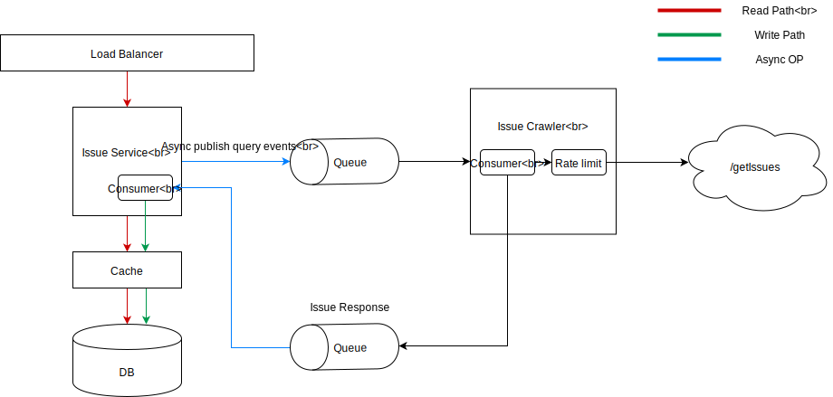

# Scalable Issue Summary Service
Author : Rohan Gulati

## Overview
The design is inspired by 2 facts about `/getIssues` API
* it is very slow
* it is rate limited

## Architecture


There are 2 major components
* issue-service - handles all the client traffic of `/getWeeklySummary` API. It read from the `issuelogs` db directly 
and serves the request traffic. Additionally, it pushes all query events asynchronously to a queue. 
These events are then consumed by `issue-crawler`
* issue-crawler - calls the `/getIssues` to fetch data and push this to a queue

#### Refresh Policy
You can set a `RefreshPolicy` in the `issue-crawler` module which details how often you
want to refresh the data for a given `projectId`. This is done to ensure that there is no starvation of minority request
in case the query pattern is skewed and there is a large number of request for a small set of projectIds

#### Scalability
The scalability of this design comes from the fact that the slow `/getIssues` request is called in the
read path of any client request. All communications with the `/getIssues` API is done in the crawlers asynchronously. 
There design choice helps in achieving horizontally scalability of the `issue-service` while meeting strict
read SLA requirements.

Also, due to asynchronous nature of communication, for every first request for a new `projectId` we will not find data 
in the system. But all subsequent request should be able to retrieve the results.
    

## Installation

Prerequisites

This project is written in java and uses maven for build. To install these, see below

* [Java](https://java.com/en/download/help/download_options.xml)
* [Maven](https://maven.apache.org/install.html)

Once you have java and maven setup on your machine, go to the project root directory containing
 `pom.xml` and run
```bash
mvn clean install
```

Finally, to run the project mode execute the following command from the root directory of
the project
```bash
cd issue-api
mvn clean spring-boot:run
```

To run test cases,

```bash
mvn clean test
```


